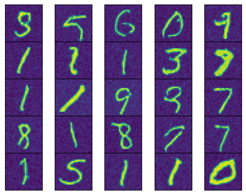

# Score-Based Generative Modeling In JAX

This repository contains an pedagogical tutorial implementation of [*Score-Based Generative Modeling through Stochastic Differential Equations* (Song et al., 2021)](https://arxiv.org/pdf/2011.13456) in [JAX](https://jax.readthedocs.io/en/latest/index.html) and [Equinox](https://docs.kidger.site/equinox/). Some boilerplate code is borrowed from the (recommended) tutorials/implementation [here](https://docs.kidger.site/equinox/examples/score_based_diffusion/) and [here](https://github.com/homerjed/sbgm). 

The main files to look at are as follows:
- `main.py` - loss function and gradient computation in JAX + training loop
- `samplers.py` - modules representing a forward (noising) SDE and its reverse-time counterpart
- `demos/Tutorial.ipynb` - detailed tutorial notebook with additional background information.

To get started, create a virtual environment and install required packages as follows:

```
python -m venv venv
source venv/bin/activate
python -m pip install -r requirements.txt
```

Afterward, you can run the main training loop with `python main.py`, or add this virtual environment to Jupyter and work through the `demos/Tutorial.ipynb` notebook.

